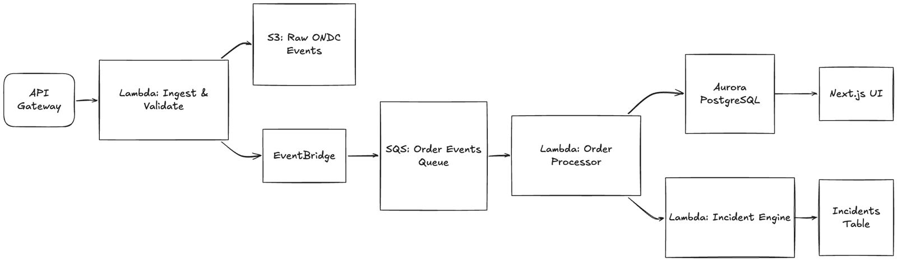

# ONDC Pulse

**Transaction-Level Observability for the Open Network for Digital Commerce**

ONDC Pulse is a robust observability and reliability platform designed specifically for ONDC Seller Network Participants. While existing ONDC dashboards provide high-level network and participant metrics (e.g., attempt-to-confirm rates), ONDC Pulse delivers **transaction-level observability**. 

It traces individual orders, ingests raw ONDC protocol webhooks, normalizes them into a canonical event stream, and reconstructs each order's state machine to detect failures and SLA breaches in real-time.

---

## Architecture & Data Flow

To handle the unpredictable and spiky nature of ONDC webhook traffic without dropping callbacks (which results in lost order states), ONDC Pulse uses a fully decoupled, event-driven serverless architecture on AWS.



### The Flow:
1. **API Gateway & Ingestion Lambda:** Receives ONDC webhooks (e.g., `/search`, `/on_confirm`). It immediately validates the schema, pushes the raw JSON payload to S3 (for audit and compliance), and forwards a normalized event to EventBridge. This ensures a fast `200 OK` response to the caller.
2. **EventBridge & SQS:** EventBridge acts as the event router, pushing normalized order events into an SQS queue. SQS buffers these events, smoothing out massive write spikes and protecting downstream databases from connection exhaustion.
3. **Order Processor Lambda:** Pulls events from SQS and processes them through a strict, deterministic State Machine. It updates the database only if the state transition is valid (e.g., rejecting a transition from `SEARCHED` directly to `CONFIRMED`).
4. **Aurora PostgreSQL:** Serves as the source of truth, enforcing strict relational integrity and tenant isolation via `tenant_id`. 
5. **Incident & SLA Engine:** Calculates time gaps between key milestones (e.g., `assign_time - confirm_time`). If an SLA threshold is breached, the Incident Engine groups the failures by tenant and creates actionable incident tickets instead of spamming operators.
6. **Next.js Dashboard:** Operators use the UI to view real-time order timelines, analyze P95/P99 latencies, and resolve incidents.

---

## Tech Stack

### Core Technologies
- **Next.js (React):** Frontend dashboard for real-time order tracking and incident management.
- **Node.js & TypeScript:** Core logic and Lambda handlers, ensuring type safety across the entire stack.
- **Prisma ORM:** Database management and schema migrations.
- **PostgreSQL (Aurora):** Relational database chosen for ACID compliance and complex analytical queries.

### AWS Serverless Infrastructure
- **Amazon API Gateway:** Secure and scalable entry point for all incoming ONDC callbacks.
- **AWS Lambda:** Serverless compute for ingestion, order processing, and incident generation.
- **Amazon EventBridge & SQS:** Decoupled event routing and buffering.
- **Amazon S3:** Immutable raw storage for auditing ONDC protocol JSONs.
- **AWS CDK:** Infrastructure as Code (IaC) to define, provision, and deploy the entire stack reliably.

---

## Getting Started

### Prerequisites
- Node.js (v18+)
- AWS CLI configured with necessary permissions
- Docker (for local PostgreSQL testing)

### Installation
1. Clone the repository:
   ```bash
   git clone https://github.com/ArchieTansaria/pulse.git
   cd datadog-for-ondc
   ```
2. Install dependencies (using npm workspaces):
   ```bash
   npm install
   ```

3. Setup the database locally:
   ```bash
   cd packages/database
   npx prisma generate
   npx prisma migrate dev
   ```

4. Run the development server (API & Next.js UI):
   ```bash
   npm run dev
   ```

---

## License
This project is licensed under the MIT License.